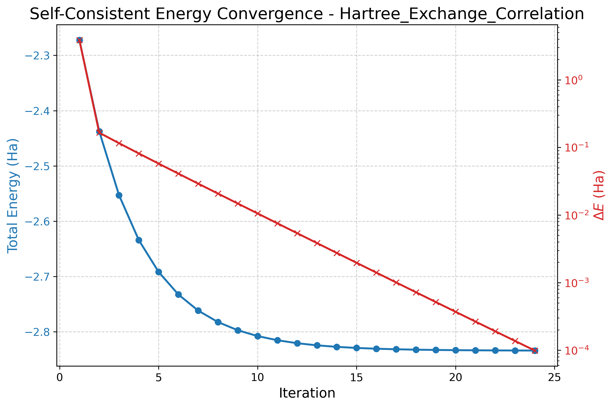
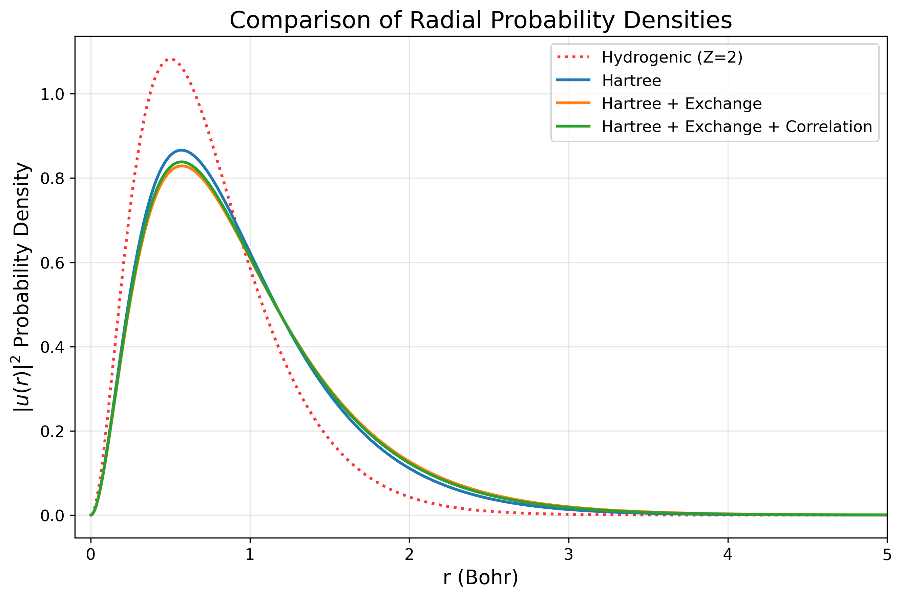

# Density Functional Theory for Helium Atom <!-- omit from toc -->

The goal of this project is to implement a **Self-Consistent Field (SCF)** solver to determine the ground state properties of the Helium atom using **Density Functional Theory (DFT)** by employing different approximation levels for the effective potential:

- **Hartree only**
- **Hartree + Exchange**
- **Hartree + Exchange + Correlation**

---
<!-- omit from toc -->
## Table Of Contents

- [Dependencies](#dependencies)
- [Usage](#usage)
- [Configuration](#configuration)
- [Output](#output)
- [Background Theory](#background-theory)
  - [DFT Kohn-Sham equation](#dft-kohn-sham-equation)
  - [Self-consistency](#self-consistency)
  - [Spherical symmetry and radial equation](#spherical-symmetry-and-radial-equation)
  - [Local Density Approximation (LDA) for exchange and correlation](#local-density-approximation-lda-for-exchange-and-correlation)
  - [Total Energy](#total-energy)
- [Available Models](#available-models)
- [Implementation](#implementation)
  - [Self-Consistent loop](#self-consistent-loop)
  - [Schrödinger Equation Integration](#schrödinger-equation-integration)
  - [Hartree potential via Poisson equation](#hartree-potential-via-poisson-equation)
  - [Self-interaction handling](#self-interaction-handling)
- [Results](#results)
  - [Total energy and Ionization Energy](#total-energy-and-ionization-energy)
  - [Charge Distribution](#charge-distribution)
  - [Potential Landscape](#potential-landscape)
  - [Discussion](#discussion)
- [Conclusions](#conclusions)

---

## Dependencies

<!-- omit from toc -->
### Core (required)

- Python 3.x
- numpy
- scipy
- pyyaml

<!-- omit from toc -->
### Optional (only for the provided plotting script)

- pandas
- matplotlib

---

## Usage

<!-- omit from toc -->
### 1) Configure parameters

Edit `config.yaml` to choose grid parameters, SCF thresholds/mixing, and whether to include exchange/correlation.

<!-- omit from toc -->
### 2) Run the solver

From the repository root:

```bash
python DFT_helium.py
```

The program performs an initial “independent-electron” solve and then enters a SCF loop, writing outputs into the configured output directory.

<!-- omit from toc -->
### 3) (Optional) Quick plots

After a successful run, you can visualize the results using any preferred tool (MATLAB, Julia, gnuplot, custom scripts, etc.). For convenience, a Python plotting script is included:

```bash
python visualization/plot_results.py <input_dir> [plot_label] [output_dir]
```

- `input_dir`: Directory path containing the input data files to be processed
- `plot_label`: optional, label or identifier used for naming and titling the generated plots
- `output_dir`: optional, directory path where the output files and plots will be saved

This script reads the output files and generates figures showing SCF convergence, radial density/amplitude, and potential profiles.

<!-- omit from toc -->
### 4) (Optional) Automated Execution

The repository includes the script `run_dft_suit.sh`, which automates the sequential execution of the three possible configurations:

- Hartree
- Hartree + Exchange
- Hartree + Exchange + Correlation

To run the script type

```bash
> bash ./run_dft_suite.sh [path_to_python.exe]
```

where `path_to_python.exe` is the absolute path to the Python executable. If omitted it defaults to `python3`

---

## Configuration

All runtime parameters are controlled via `config.yaml`.

The parameters are:

<!-- omit from toc -->
### Grid

- `r_min`, `r_max`: radial domain
- `h`: grid step

<!-- omit from toc -->
### Eigenvalue search

- `E_min`, `E_max`: energy search interval
- `rough_step`: rough scan step to locate a sign change before bisection

<!-- omit from toc -->
### SCF

- `max_iter`: maximum iterations for the self consistent cycle
- `TOTEN_threshold`: convergence threshold based on `|ΔE_total|`
- `mix_alpha`: linear mixing parameter for the effective potential

<!-- omit from toc -->
### Model toggles

- `use_exchange`: enable LDA exchange potential
- `use_correlation`: enable LDA correlation potential (using Ceperley-Alder parameterization)

<!-- omit from toc -->
### Outputs

- `out_dir`: output directory
- `scf_log_csv`: SCF log filename
- `profiles_dat`: radial profiles filename

Implementation note: if `r_min` is set to `0`, it is internally replaced by a small positive value to avoid divisions by zero at the origin.

---

## Output

Two main files are produced under `out_dir` (default `outputs/`):

<!-- omit from toc -->
### 1) `scf_log.csv`

A CSV log of the SCF iterations, including quantities such as:

- `iter`
- `eps_1s` (single-particle eigenvalue)
- `E_tot` (total energy)
- `dE` (difference from previous iteration)

<!-- omit from toc -->
### 2) `profiles_final.dat`

A whitespace-separated table of final radial profiles, it includes:

- `r` (grid)
- `u` (radial amplitude)
- `V_H` (Hartree potential)
- `V_x` (exchange, if enabled)
- `V_c` (correlation, if enabled)
- `V_eff` (final effective potential)

Note: all the results are given in Atomic Units.

---

## Background Theory

>NOTE:\
>throughout the rest of this document **Atomic Units** are used.

### DFT Kohn-Sham equation

When a system is studied using DFT, one introduces a fictitious system of non-interacting electrons that reproduces the exact interacting density and by the Hohenberg–Kohn theorems, this density uniquely determines the ground-state properties. The fictitious non-interacting system is governed by the Kohn–Sham (KS) equation which reads:

$$
\left[-\frac{1}{2}\nabla^2 + V_\mathrm{eff}(\mathbf{r})\right]\phi_i(\mathbf{r}) = \varepsilon_i \phi_i(\mathbf{r}),
$$

with the density:

$$
n(\mathbf{r}) = \sum_i f_i|\phi_i(\mathbf{r})|^2,
$$

where $f_i$ are occupations.

The effective potential is decomposed as:

$$
V_{\mathrm{eff}}(\mathbf{r}) = V_{\mathrm{ext}}(\mathbf{r}) + V_{H}[n] (\mathbf{r}) + V_{xc}[n] (\mathbf{r}),
$$

where:

- $V_\mathrm{ext}$ is the nuclear attraction ($V_\mathrm{ext}(r) = -Z/r$),
- $V_H$ is the Hartree (classical Coulomb) potential,
- $V_{xc}$ is the exchange-correlation potential (all many-body effects beyond Hartree).

<!-- omit from toc -->
#### Hartree potential

The Hartree potential is:

$$
V_H(\mathbf{r}) = \int \frac{n(\mathbf{r}')}{|\mathbf{r} - \mathbf{r}'|} \ d^3r'.
$$

It can also be obtained by solving Poisson’s equation:

$$
\nabla^2 V_H(\mathbf{r}) = -4\pi n(\mathbf{r})
$$

<!-- omit from toc -->
#### Exchange-correlation

The exchange-correlation energy is defined by:

$$
E_{xc}[n] = E[n] - T_s[n] - \int V_\mathrm{ext}(\mathbf{r})n(\mathbf{r}) \ d^3r - E_H[n],
$$

where $T_s[n]$ is the kinetic energy of the non-interacting KS system and the Hartree energy is:

$$
E_H[n] = \frac{1}{2}\iint \frac{n(\mathbf{r})n(\mathbf{r}')}{|\mathbf{r}-\mathbf{r}'|} \ d^3r \ d^3r'.
$$

Given an approximation for $E_{xc}[n]$, the KS exchange-correlation potential is obtained by functional derivative:

$$
V_{xc}(\mathbf{r}) = \frac{\delta E_{xc}[n]}{\delta n(\mathbf{r})}.
$$

For convenience, it can be separated into exchange and correlation contributions:

$$
V_{xc}(r) = V_x(r) + V_c(r).
$$

### Self-consistency

Because $V_\mathrm{eff}$ depends on $n(r)$, and $n(r)$ depends on the KS orbitals, the KS equations must be solved self-consistently:

1. guess $n(r)$ or $V_\mathrm{eff}(r)$,
2. solve KS for orbitals and $\varepsilon_i$,
3. build new density $n_\mathrm{new}(r)$,
4. update $V_\mathrm{eff}$ from $n_\mathrm{new}$,
5. repeat until convergence.

Mixing is often used to stabilize convergence:

$$
V_\mathrm{in}^{(i+1)} = \alpha V_\mathrm{out}^{(i)} + (1-\alpha)V_\mathrm{in}^{(i)}.
$$

where $\alpha$ is called *mixing parameter* ($0 \le\alpha \le 1$).

### Spherical symmetry and radial equation

For atoms, the external potential and ground-state density are spherically symmetric. Using separation of variables:

$$
\phi_{nlm}(r,\theta,\phi) = \frac{u_{nl}(r)}{r}Y_{lm}(\theta,\phi),
$$

the KS equation reduces to a radial equation for $u_{nl}(r)$. For $l=0$ (1s orbital) and $n=1$ (ground state), the term that depends on angular momentum vanishes and one solves:

$$
\left[-\frac{1}{2}\frac{d^2}{dr^2} + V_\mathrm{eff}(r)\right]u(r) = \varepsilon u(r)
$$

where $u(r) \equiv u_{10}(r)$.

Helium has a doubly occupied 1s orbital (spin up + spin down), thus the  density is:

$$
n(r) = 2|\phi_{1s}(r)|^2 = \left | \frac{u(r)}{r}Y_{00}(\theta,\phi) \right |^2 = 2\frac{|u(r)|^2}{4\pi r^2}.
$$

### Local Density Approximation (LDA) for exchange and correlation

The exact form of the exchange-correlation potential $V_{xc}(\mathbf{r})$ is unknown, it must be expressed using models and approximations. In general, for a non-homogeneous system, it is a function of the density and its gradients

$$V_{xc}(\mathbf{r}) = V_{xc}(n, \nabla n, \nabla^2 n, \ldots)$$

The Local Density Approximation (LDA) assumes that, at each point the XC potential is well approximated by that of a uniform electron gas (UEG) evaluated at the local density $n(\mathbf{r})$.

<!-- omit from toc -->
#### LDA exchange

For an UEG:

$$
V_x(r) = -\left(\frac{3}{\pi}\right)^{1/3} n^{1/3}(r).
$$

Using the helium density written in terms of $u(r)$:

$$
V_x(r) = -\left[\frac{3u^2(r)}{2\pi^2 r^2}\right]^{1/3}.
$$

<!-- omit from toc -->
#### LDA correlation (Ceperley–Alder / Perdew–Zunger parameterization)

Correlation is included through a standard UEG-based parameterization derived from Quantum Monte Carlo data (Ceperley–Alder) and fit by Perdew–Zunger. Define the Wigner–Seitz radius $r_s$ by:

$$
n = \frac{3}{4\pi r_s^3}.
$$

The correlation potential is expressed in terms of the correlation energy per particle $\varepsilon_c(r_s)$ as:

$$
V_c(r_s) = \left(1-\frac{r_s}{3}\frac{d}{dr_s}\right)\varepsilon_c(r_s).
$$

where $\varepsilon_c$ is defined by

$$
E_c = \int d^3r \ \varepsilon_c [n(\mathbf{r})] (\mathbf{r}),
$$

a commonly used parameterization for $\varepsilon_c$ is:

- For $r_s \ge 1$:

$$
\varepsilon_c = \frac{\gamma}{1+\beta_1\sqrt{r_s}+\beta_2 r_s},
$$

which leads to:

$$
V_c(r_s)= \varepsilon_c
\frac{1+\frac{7}{6}\beta_1\sqrt{r_s}+\frac{4}{3}\beta_2 r_s}{1+\beta_1\sqrt{r_s}+\beta_2 r_s} \quad \mathrm{for} \quad r_s \ge 1.
$$

- For $r_s < 1$:
  
$$
\varepsilon_c = A\ln r_s + B + C r_s \ln r_s + D r_s,
$$

which leads to:

$$
V_c(r_s)=A\ln r_s + B - \frac{A}{3} + \frac{2}{3}C r_s \ln r_s + \frac{(2D-C)}{3}r_s \quad \mathrm{for} \quad r_s < 1.
$$

where $\beta_1$, $\beta_2$, $\gamma$, A, B, C, D are tabulated parameters.

### Total Energy

The LDA $V_x(r)$ and $V_c(r)$ enter the self-consistent Kohn–Sham effective potential

$$
V_\mathrm{eff}(r)=V_\mathrm{ext}(r)+V_H(r)+V_x(r)+V_c(r).
$$

Once the KS equations are solved, the total energy of the system is computed by summing the single-particle eigenvalues $\varepsilon_i$ and subtracting the double-counted interaction terms:

As described in [Spherical symmetry and radial equation](#spherical-symmetry-and-radial-equation), for the Helium atom in its ground state:

$$
n(r) = \frac{u(r)^2}{2\pi r^2},
$$

thus integrals of the kind $f(r)n(r)$ becomes

$$
\int f(r) n(r) d^3r = \int_{0}^{\infty} f(r) n(r) 4\pi r^2 dr = \int_{0}^{\infty} f(r) \frac{u^2}{2\pi r^2} 4\pi r^2 dr = 2 \int_{0}^{\infty} f(r) u(r)^2 dr.
$$

With a doubly occupied 1s orbital ($\sum_i \varepsilon_i = 2\varepsilon$), the total energy is given by

$$
E_{\mathrm{tot}} = 2\varepsilon - \int dr\  V_H(r) \ u^2(r) - \frac{1}{2}\int dr \  u^2(r) \  V_x(r) + 2 \int dr \  u^2(r)(\varepsilon_c(r)-V_c(r))
$$

---

## Available Models

By changing the booleans `use_exchange` and `use_correlation` in `config.yaml`, it is possible to switch between:

- **Hartree-only**:
  
  $$V_\mathrm{eff}(r) = V_\mathrm{ext}(r) + V_H(r)$$

  Note:\
  In this case the Hartree term is computed from the **single-electron density** to remove self-interaction by construction (see [Self-interaction handling](#self-interaction-handling))

- **Hartree + exchange**:
  
  $$V_\mathrm{eff}(r) = V_\mathrm{ext}(r) + V_H(r) + V_x(r)$$

- **Hartree + exchange + correlation**:
  
  $$V_\mathrm{eff}(r) = V_\mathrm{ext}(r) + V_H(r) + V_x(r) + V_c(r)$$

---

## Implementation

### Self-Consistent loop

The core part of the project is the self-consistent loop, whose logic is defined in a while loop in the `DFT_helium.py`. It follows a standard SCF iteration:

1. Start from an initial guess $V_{\text{eff}}^{(0)}$
2. Solve the radial KS equation $\rightarrow (u^{(k)}, E^{(k)})$
3. Build a new potential $V_{\text{eff}}^{\text{out}}[u^{(k)}]$
4. Apply **linear mixing** to stabilize convergence:

   $$V_{\text{eff}}^{(k+1)} = \alpha V_{\text{eff}}^{\text{out}} + (1-\alpha)V_{\text{eff}}^{(k)}$$

   where $\alpha$ is set in `config.yaml`
5. stop when the total energy change $|\Delta E_{\text{tot}}|$ is below the tolerance.

Pseudo-code:

```python
while it < max_iterations:
    u_new, eps_new = solve_schrodinger(..., V_eff_in)
    V_eff_out, V_H, V_x, V_c, ec = get_V_eff(u_new, ...)
    E_tot_new = get_TOTEN(eps_new, u_new, ..., V_H, V_x, V_c, ec)

    if abs(E_tot_new - E_tot_old) < threshold:
        break

    V_eff_in = alpha * V_eff_out + (1 - alpha) * V_eff_in
    E_tot_old = E_tot_new
    it += 1
```

<!-- omit from toc -->
#### Bootstrap

To bootstrap the SCF loop the non interacting electron density is calculated from the fully non interacting electron problem:

$$
\left[-\frac{1}{2}\frac{d^2}{dr^2} - \frac{Z}{r} \right]u^{(0)}(r) = \varepsilon u^{(0)}(r) \quad \rightarrow \quad n^{(0)}(r)=\frac{u^{(0)}(r)^2}{2\pi r^2}
$$

and $n^{(0)}(r)$ is used to calculate $V_H^{(0)}$ , $V_x^{(0)}$ and $V_c^{(0)}$.

<!-- omit from toc -->
#### Convergence example

The plot below shows a representative self-consistent convergence run for the Hartree + Exchange + Correlation case. The blue curve reports the total energy (left y-axis), while the red curve shows the iteration-to-iteration change $\Delta E$ (right y-axis, logarithmic scale).



The total energy quickly approaches a stable plateau, at the same time, the iteration-to-iteration change $\Delta E$ drops by several orders of magnitude, confirming that the SCF cycle has reached convergence.

### Schrödinger Equation Integration

The Schrödinger equation integrations are performed by the function `solve_schrodinger` in `source/solver.py`. This function combines:

- **Verlet 1D integration** implemented by the function `verlet_integrate_1D` in `source/solver.py`
- **bisection** (`scipy.optimize.bisect`) to find the eigenvalue $\varepsilon$ such that the boundary condition $u(0)=0$ is satisfied.

<!-- omit from toc -->
#### The verlet algorithm

The Verlet algorithm allows the integration of differential equations in the the form:

$$
\ddot{\mathbf{x}}(t) = F(\mathbf{x}(t))
$$

i.e. where the first derivative does not appear.\
If the time gets discretized with step $\Delta t$, the Verlet algorithm calculates the value of $\mathbf{x}(t+\Delta t)$ as

$$
\mathbf{x}(t + \Delta t) = 2\mathbf{x}(t) - \mathbf{x}(t - \Delta t) + F(\mathbf{x}(t)) \Delta t^2 + \mathcal{O}(\Delta t^4),
$$

once $\mathbf{x}(0)$ and $\mathbf{x}(\Delta t)$ are given, the algorithm gives the completely integrated solution $\mathbf{x}(t)$.

The Schrödinger equation that has to be solved for the Helium atom with the DFT theory seen in [Spherical symmetry and radial equation](#spherical-symmetry-and-radial-equation), can be rewritten as

$$
\ddot{u}(r)=(2V_{\mathrm{eff}}(r)-2\varepsilon)u(r)
$$

therefore this equation can be solved through the Verlet algorithm in which $\mathbf{x} \rightarrow u$, $t \rightarrow r$ $\Delta t \rightarrow \Delta r \equiv h$ and

$$
F(u(r))= 2 (V_{\mathrm{eff}}(r)-\varepsilon) \ u(r).
$$

The Verlet algorithm is bootstrapped by using the hydrogenic solution at high distance

$$
\begin{cases}
    u(r_\mathrm{max})= r_\mathrm{max} \ e^{-Z r_\mathrm{max}}\\
    u(r_\mathrm{max} - h) = (r_\mathrm{max} -h) \ e^{-Z r_\mathrm{max}+Zh}.
\end{cases}
$$

This approach leverages the asymptotic behavior of the system where electron interactions become negligible, allowing accurate initialization of the iterative algorithm from physically meaningful starting conditions.

Since the initial points are defined at $r_\mathrm{max}$ and $r_\mathrm{max} - h$, the Verlet algorithm integrates **backwards** from $r_\mathrm{max}$ to $r = 0$.

>NOTE:\
>the code always solves the Schrödinger equation for a single electron, then it consider that the total density is given by two times the single electron density.

<!-- omit from toc -->
#### The bisection method

If the eigenvalue $\varepsilon$ is known, the solution $u(r)$ is obtained by a single application of Verlet integration. However, since $\varepsilon$ is initially unknown, the integration must be performed iteratively to find the value for which the boundary condition $u(0)=0$ is satisfied. This procedure is managed by the `solve_schrodinger` function, which utilizes `scipy.optimize.bisect` to identify the root of the wavefunction at the origin as a function of $\varepsilon$.

To function correctly, the bisection method requires an interval $[a, b]$ where the function $u(0; \varepsilon)$ changes sign. Consequently, the algorithm first performs a coarse scan within the range $[E_{\min}, E_{\max}]$ using a fixed step `rough_step` to locate this sign change. The parameters $E_{\min}$, $E_{\max}$, and `rough_step` are defined in the `config.yaml` file.

`bisect` is called with a tolerance of $10^{-8}$ (A.u.).

After convergence, the radial solution is normalized so that $\int_0^\infty |u(r)|^2dr = 1$.

<!-- omit from toc -->
#### Summary of `solve_schrodinger` workflow

1. **Initialization and Coarse Scan**: The function performs a preliminary sweep across the range ($E_{\min}$, $E_{\max}$) with steps of `rough_step` to identify an interval $[a, b]$ where the wavefunction value at the origin, $u(0; \varepsilon)$, changes sign.
2. **Root-Finding Loop**: It invokes `scipy.optimize.bisect` inside the range $[a, b]$ to precisely identify the eigenvalue $\varepsilon$ that satisfies the boundary condition $u(0) = 0$ within a tolerance of $10^{-8}$ A.u.
3. **Backward Integration**: During each iteration of the bisection, `verlet_integrate_1D` is called. It initializes the wavefunction at $r_{\max}$ using the asymptotic hydrogenic solution and integrates **backwards** to the origin.
4. **Normalization and Density**: Once the optimal $\varepsilon$ is found, the resulting radial solution $u(r)$ is **normalized** to ensure $\int_0^{\infty} |u(r)|^2 dr = 1$ (using `scipy.integrate.simpson`).

### Hartree potential via Poisson equation

Another noteworthy procedure is the calculation of the Hartree potential $V_H$ through the resolution of the Poisson equation:

$$
\nabla^2 V_H(\mathbf{r}) = -4\pi n(\mathbf{r}).
$$

This is implemented by the `get_V_h` function in `source/dft_potentials.py`.

Using the Laplacian in spherical coordinates:

$$
\nabla ^2 V_H ​= \frac{1}{r}\frac{d^2}{dr^2}​(rV_H​).
$$

By defining the auxiliary function $U(r) = rV_H(r)$ and substituting the radial density of a single electron $n(r) = \frac{u^2(r)}{4\pi r^2}$, the Poisson equation reduces to a one-dimensional second-order differential equation:

$$
\frac{d^2U(r)}{dr^2}=-\frac{u^2(r)}{r}.
$$

The solution $U(r)$ is subject to two boundary conditions:

- **At the origin**: $U(0) = 0$.
- **Asymptotically**: $U(r \rightarrow \infty) = N$, where $N$ is the total number of electrons. This ensures that $V_H$ behaves as a Coulomb potential $Q/r$ at large distances.

<!-- omit from toc -->
#### Numerical strategy

Rather than employing a shooting method (like bisection), the algorithm exploits the linearity of the differential equation. The general solution is expressed as the sum of a particular solution and a homogeneous solution:

$$U_\mathrm{sol} = U_\mathrm{homo} + U_\mathrm{part}.$$

Therefore the Poisson equation can be solved through the following procedure:

1. **Particular Solution**: Compute $U_{\text{part}}(r)$ using the Verlet algorithm. The integration is bootstrapped from the origin with the initial conditions $U(0) = 0$ and $U(h) = 0$.
2. **Homogeneous Solution**: The corresponding homogeneous equation $U'' = 0$ has the general solution $U_{\text{hom}}(r) = \alpha r$. This solution naturally satisfies $U(0) = 0$. The slope $\alpha$ is determined by enforcing the boundary condition at $r_{\max}$:

    $$U(r_{\max}) = U_\mathrm{part}(r_\mathrm{max})+\alpha r_\mathrm{max} = q_{\max}$$

    with

    $$q_{\max} = \int_0^{r_{\max}} u(r)^2 \ dr \approx 1$$

    yielding:

    $$\alpha = \frac{1-U_{\text{part}}(r_{\max})}{r_{\max}}$$

3. **Reconstruction**: The final Hartree potential is reconstructed as:

   $$V_H(r) = \frac{U_{\text{part}}(r)}{r} + \alpha.$$

### Self-interaction handling

A key implementation detail concerns the definition of the Hartree potential $V_H$, which varies depending on the chosen level of theory (`Hartree only` vs `DFT`). This distinction is necessary to correctly handle **Self-Interaction**.

The function `get_V_h(u_r)` in `source/dft_potentials.py` solves the radial Poisson equation for a probability density normalized to 1 ($\int |u|^2 dr = 1$). Consequently, it returns the potential generated by a single electron.

<!-- omit from toc -->
#### 1. Hartree Limit (Independent Particles)

When `use_exchange = False` and `use_correlation = False`, the code simulates the classical Hartree approximation (Hartree theory).
In this model, electron $i$ moves in the mean field generated by the $N-1$ *other* electrons. For the Helium ($N=2$), Electron 1 experiences only the potential of Electron 2.

- **Source Density:** $n(r) = |u(r)|^2$
- **Effective Potential:** $V_{eff} = V_{ext} + V_H[|u(r)|^2]$
- **Implementation:**

  ```python
  V_H = get_V_h(u_r, r)  # Potential of 1 electron
  ```

In this scheme, self-interaction is excluded by construction.

<!-- omit from toc -->
#### 2. DFT Kohn-Sham with LDA

When Exchange or Correlation are active, the code switches to the Kohn-Sham DFT formalism. Here, the Hartree potential is defined as a functional of the **total electronic density** $n(\mathbf{r})$ thus $n(r) = 2|u(r)|^2$.

- **Source Density:** $n(r) = 2|u(r)|^2$
- **Effective Potential:** $V_{eff} = V_{ext} + V_H[2|u(r)|^2] + V_{xc}[n]$
- **Implementation:**
  
  ```python
  V_H = 2 * get_V_h(u_r, r)  # Potential of total density
  ```

In this scenario, the Hartree term includes the Self-Interaction. The role of the exchange and correlation potential is to cancel out this spurious contribution.

---

## Results

The results presented below were obtained by executing the `run_dft_suite.sh` script using the default parameters specified in the `config.yaml` file included with the program.

### Total energy and Ionization Energy

The following table summarizes the computed ground state energy of the Helium atom, and the single electron eigenvalues across the three different levels of theory adopted:

| Model | Ground State Energy (Hartree) | Single Electron Eigenvalue (Hartree) |
| ----- | ----------------------------- | ------------------------------------ |
| Hydrogenic | -4.000 | -2.000 |
| Hartree | -2.8615 | -0.9179 |
| Hartree + Exchange | -2.7234 | -0.5169 |
| Hartree + Exchange + Correlation | -2.8340 | -0.5701 |
| Experimental | -2.9037 | -0.903 |

All values are expressed in atomic units (Hartree). For the experimental single electron eigenvalue, the listed value is the negative of the first ionization energy $(-I_1)$.

### Charge Distribution

The figure below displays the electronic probability density $|u(r)|^2$ for the three different approximation levels, together with the solution for the hydrogenic model ($V_\text{eff}=V_\text{nuc}$). Note that in this figure $V_\mathrm{eff}$ excludes the nuclear potential that is plotted aside.

<!--  -->

<p align="center">
  
</p>

### Potential Landscape

The figure below breaks down the components of the total effective potential ($V_\text{eff}$) for the fully correlated model.


<!-- ```html

``` -->

This visualization highlights the competition between the attractive nuclear potential ($-Z/r$) and the repulsive Hartree screening ($V_H$), as well as the relative magnitudes of the Exchange ($V_x$) and Correlation ($V_c$) corrections.

### Discussion

From the density distribution plot it is clear that the introduction of the electron-electron interaction "inflate" the atomic density by shifting the probability density away from the nucleus.

- In the **hydrogenic model** electrons occupy $1s$ orbital as if the other did not exist, feeling the nuclear attraction without any screening. For the density, this results in the highest peak located closer to the nucleus (high density close to the nucleus). The obtained energy of the system (**-4.00 a.u.**) diverges significantly from the experimental value of **-2.9037 a.u.**

- In the **Hartree model**, the system gets "destabilized" and the energy increases to **-2.8615 a.u.**, closer to the experimental value. The Hartree potential introduces electron-electron repulsion, this forces the orbital to expand, shifting the electron density peak outward and reducing its maximum height.

- When switching to a standard KS-DFT setup, using **full Hartree potential plus the Exchange correction**, the total energy increases to **-2.7234 a.u.**, and the density further expands outward.This behavior is not indicative of an error, indeed the Hartree-only model uses half of the Hartree potential as an *ad hoc* modification to remove self-interaction, which leads to a fortuitous lowering of the energy through error cancellation.\
In contrast, the DFT approach uses the full Hartree term and adds an explicit exchange potential, making the resulting density more physically motivated and more transferable, and therefore the density distribution is more trustworthy than the one obtained from the half-Hartree construction.

- Finally in the **Hartree + Exchange + Correlation** model, the introduction of the correlation potential accounts for electron avoidance beyond the Pauli exclusion. In practice, this term corrects the overestimation of repulsion of the electron-electron repulsion of the Hartree + Exchange model. As a result, the system is stabilized and the total energy decreases to **-2.8340 a.u.**. Consistently, the density becomes slightly more contracted toward the nucleus compared to the exchange-only case.

---

## Conclusions

A radial Kohn–Sham DFT solver for the helium atom was successfully implemented by progressively introducing electron–electron interaction terms. The simulations clearly illustrate the competition between nuclear attraction and electronic repulsion, and how it reshapes the effective potential and the orbital.

- **Accuracy**: The fully correlated model (LDA with CA-Correlation) yields a ground state energy of -2.8340 a.u., achieving an accuracy within 2.4% of the experimental value (-2.9037 a.u.).

- **Physical Insight**: The results highlight the "screening" effect of the Hartree potential, which drives orbital expansion, and the stabilizing role of Exchange and Correlation, which partially counteracts this expansion.

- **Limitations**: The remaining discrepancy between the calculated total energy and the experimental reference is attributable to well-known limitations of LDA

Overall, this project offers a clear and compact implementation of a self-consistent Kohn–Sham solver, making it easy to inspect how different approximations (Hartree, exchange, correlation) modify the effective potential, the density, and the total energy.
